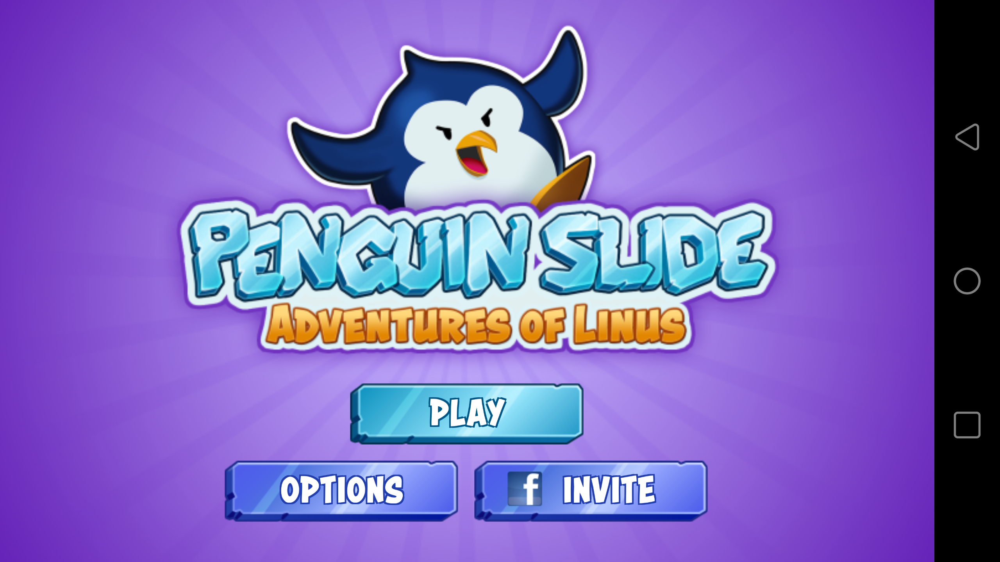
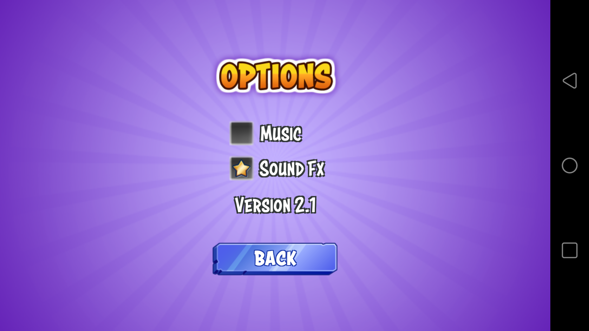
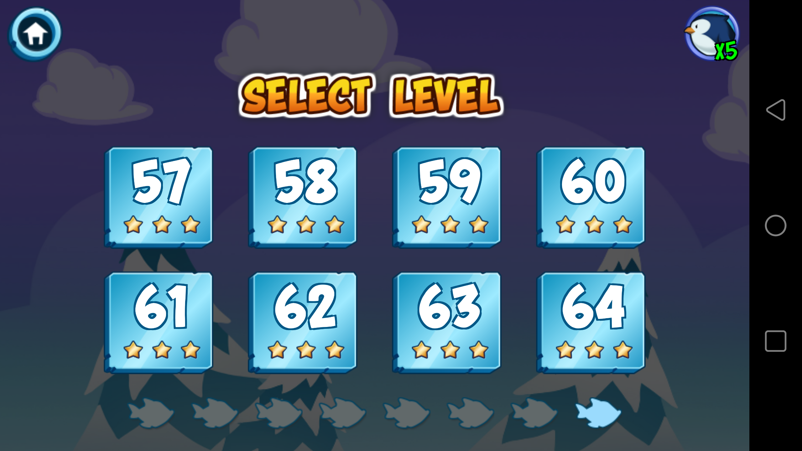
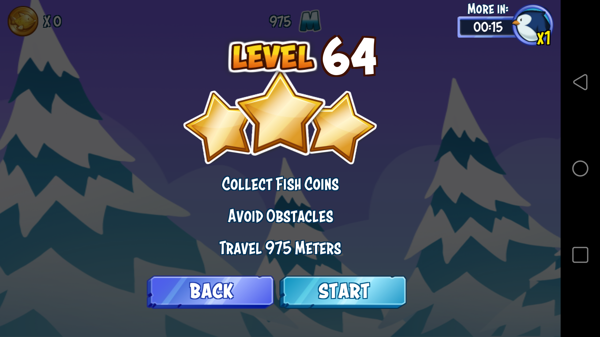
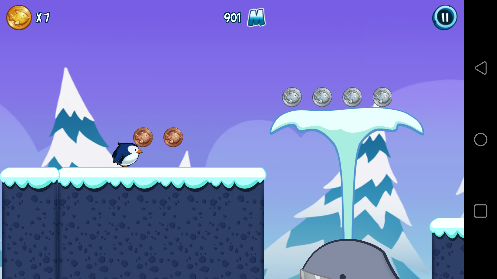
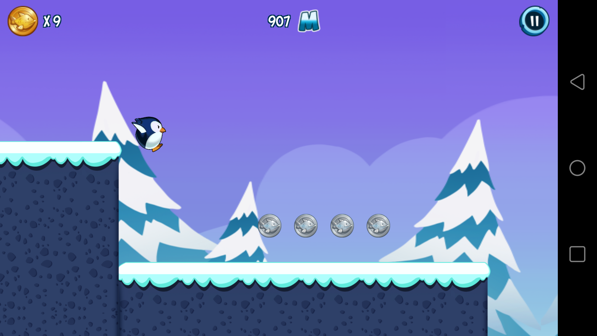

# penguin-slide-unity3d

Developement of 2D casual game in Unity3D.

Created by me:
- Gameplay code
- UI code
- Microtransaction with google play
- Analytics integration

Third party / external resources:
- Game design from team mate
- 2D art from teammate
- NGui as UI framework

